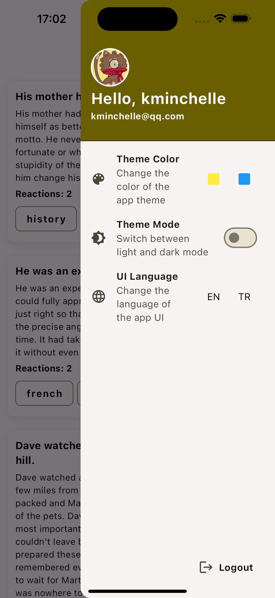
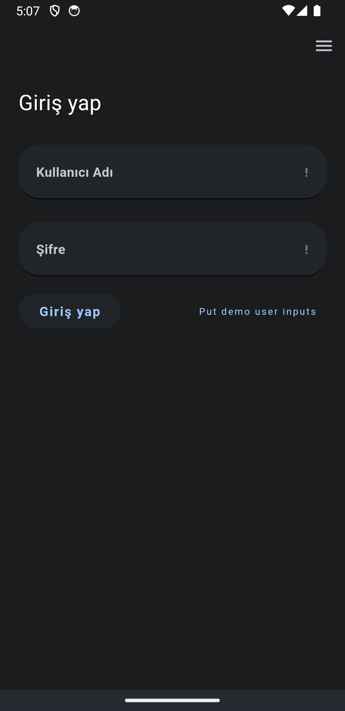

# Flutter Bloc Starter Project

This project is a starting point for a Flutter application implementing the BLoC pattern, providing a robust foundation for your next app.

<table>
  <tr>
    <td></td>
    <td></td>
  </tr>
  <tr>
    <td align="center">iOS</td>
    <td align="center">Android</td>
  </tr>
</table>

## Packages Used
Project rely on these packages to build this app:

* **State Management**: flutter_bloc for managing application state and decoupling business logic from UI.
* **Data Modeling & Serialization**: freezed and json_serializable, for immutable data modeling and JSON serialization.
* **Localization**: slang for localization support.
* **Service Location & Dependency Injection**: get_it and injectable, which provides code generation for get_it.
* **Form Management & Validation**: reactive_forms.
* **Network Requests**: dio.
* **Functional Programming**: fpdart.
* **Caching**: shared_preferences and hive for simple caching and caching fetched data for offline mode.
* **Routing**: auto_route.

## Features

Starter project includes:

- Authentication with token and refresh token
- Localization support
- Theme settings
- Caching with `shared_preferences` and `hive`
- Exception handling

Each feature is organized into four subfolders:

- `data_sources`: Contains the data sources for the feature
- `repositories`: Contains the repositories that interact with the data sources
- `presentation`: Contains the UI for the feature
- `models`: Contains the data models for the feature

## API
The project uses [dummyjson.com](https://dummyjson.com) as backend.

## Getting Started
1. Clone the repository
2. Run `flutter pub get` to install dependencies
3. Run `dart run build_runner build -d` to generate all the necessary files.
3. Run `flutter run` to start the app

## Commands
- To generate all generated files (freezed, json_serializable, slang, etc): `dart run build_runner build -d`
- To generate only slang translate files: `dart run slang`
- To generate launcher icons: `dart run flutter_launcher_icons`
- To generate splash screen: `dart run flutter_native_splash:create`
- To change app name, package name, etc: `dart run package_rename`

For icon, splash screen, and package name settings, check the `pubspec.yaml` file.

## Inspiration
This project has been influenced by various sources and best practices in the Flutter community. I'd like to acknowledge the contributions of these projects and their maintainers for helping shape my approach to building robust and scalable applications with Flutter.

## Contributing
Contributions are welcome! Please read [contributing guidelines](CONTRIBUTING.md) to get started.

## License
This project is licensed under the MIT License. See the [LICENSE](LICENSE) file for details.

## Project Link
You can find the project on GitHub: [Flutter Bloc Starter Project](https://github.com/bahaby/flutter_bloc_starter_project)